Main Panel
===========================

This is the main panel of Bmesh Clean, it looks like this once the addon is installed, if the panel is not present
, make sure you have installed the addon correctly and activated the checkbox. Here you can find how to install
the addon correctly: :ref:`installation`

.. _panel_types:

Panel Types
----------------

From Bmesh Clean version 1.1.200 the panel can be set in 2 modes, classic or with checkmark, you can change the mode
from the addon preferences, the default mode is classic, but you can change it to checkmark if you prefer :ref:`options`.

Panel Classic Style
*********************

.. image:: _static/_images/main_panel/main_panel_classic_01.webp
      :align: center
      :width: 300
      :alt: Main Panel Classic 01

|

Panel Checkmark Style
*********************

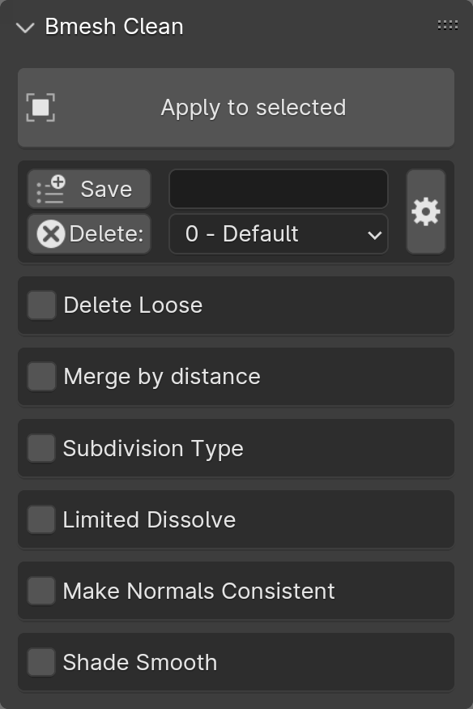

-------------------------------------------------------------------------------------------

Apply to Selected
------------------------

.. tip::
        1- To work correctly, the selected object must be a mesh object.
        2- This button only works if the properties described here below are activated, as in the example image.

Once you have selected the settings you want to apply, you can press this button to apply the chosen settings.

You can select the objects to which you want to apply these settings, the button works on multiple selected objects without limits

.. note::
        Selected objects that are not of type mesh will not be taken into consideration, so the settings will not be applied to them,
        as they are not mesh objects.

.. image:: _static/_images/main_panel/apply_to_selected_button_01.webp
      :align: center
      :width: 300
      :alt: Apply to Selected Button 01s

-------------------------------------------------------------------------------------------

Save
------------------------

This button saves the current preset so that it can be reused in the future, it needs a name before it can be saved.

.. note::
        From Bmesh Clean version 1.1.200 the saving of presets has been changed, it is done in json files and they are saved in the
        Blender addon folder: `..\Blender Foundation\Blender\ExtremeAddons\bmesh_clean_data`, in this way the presets can be shared
        even between multiple versions of Blender, but the most important thing is that when you update BmeshClean, the presets are not lost as before.

.. image:: _static/_images/main_panel/save_preset_with_name_01.webp
      :align: center
      :width: 300
      :alt: Save Preset With Name 01

|

If a preset is saved with the same name, you will be asked if you want to overwrite the existing preset
(Uppercase or lowercase letters do not make a difference)

Names containing characters not allowed by the operating system cannot be saved, for example: `'[@!#$%^&*()<>?/\|}{~:]'`
will be automatically replaced with an underscore `_`

-------------------------------------------------------------------------------------------

Delete
------------------------

This button deletes the selected preset, provided it is a preset created by you and is selected in the preset list next to the Delete button.

.. important::
        The Delete button will only remove user presets, not the default ones provided with the addon

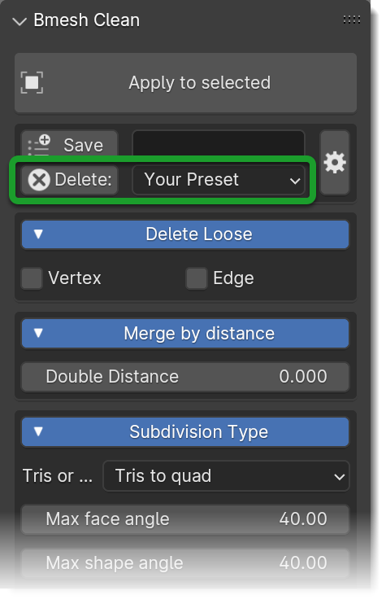

-------------------------------------------------------------------------------------------

Preset List
------------------------

By this selector, you can select the default presets or the ones saved by you, here all available presets will be displayed.

In automatic, when you choose a preset from this list, the addon automatically configures itself with the settings of the chosen preset,
So it will be enough to press the Apply to Selected button to apply the settings of the chosen preset to the selected objects.

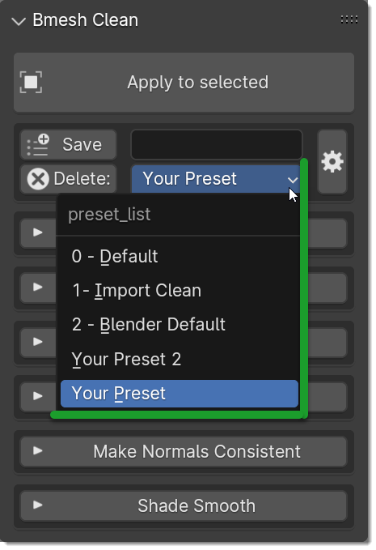

-------------------------------------------------------------------------------------------

Open Preferences Button
---------------------------

This button will take you directly to the Bmesh Clean preferences, in the Options TAB

.. note::
        The button is present only from Bmesh Clean version 1.1.200

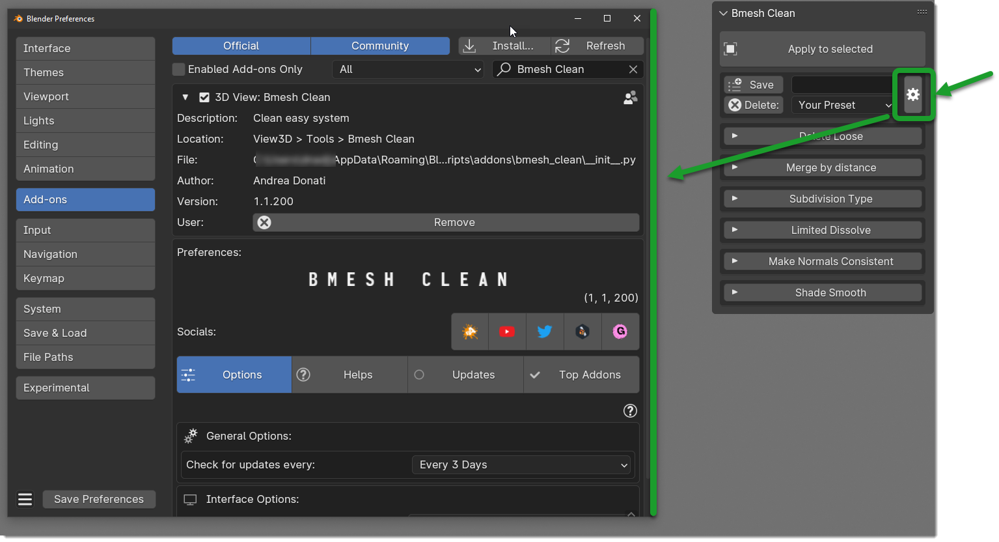

-------------------------------------------------------------------------------------------

Delete Loose
------------------------

This options removes disconnected vertices / edges

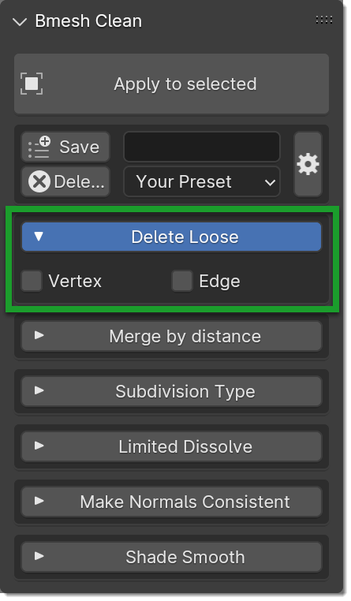

|

Here an example of disconnected vertices or Loose edge:

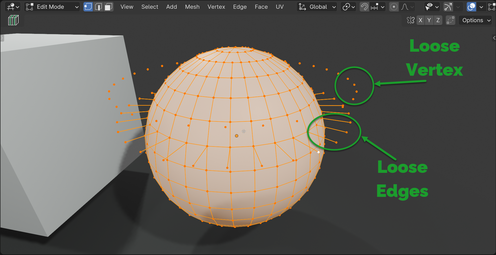

|

Vertex
*************

If active, all vertices not connected to an Edge or a face will be deleted.

Edges
*************

If active, all edges not connected to a face will be deleted.

-------------------------------------------------------------------------------------------

Merge By Distance (Remove Doubles)
-------------------------------------

This option merges vertices that are close to each other, within the distance set in the field next to the checkbox.

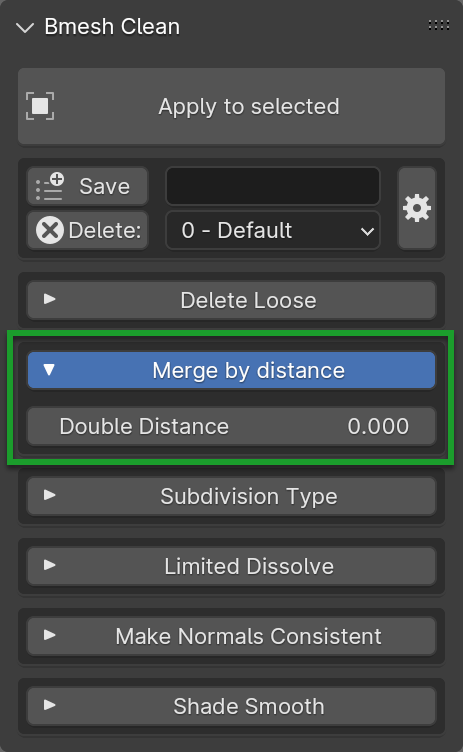

|

Distance
*************

This value represents the maximum distance between the vertices to be considered duplicates and therefore joined, one of the 2 or
more vertices present in this range will be deleted.

The value is therefore the unit of measure of the Blender coordinate system, by default it is in meters, but it can be changed
so a value of 0.001 represents 1 millimeter (If set in the decimal metric system)

-------------------------------------------------------------------------------------------

Subdivision Type
-------------------

This option allows you to choose the type of subdivision to be applied to the selected objects.

**This is an example of quad mesh:**

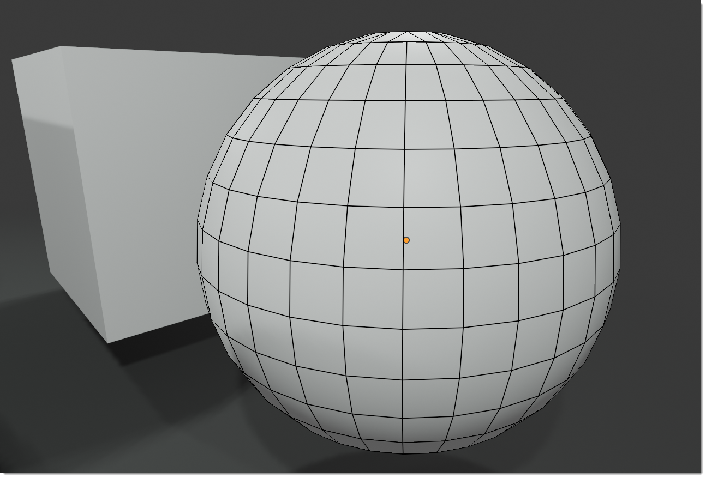

**This is an example of triangulated mesh:**

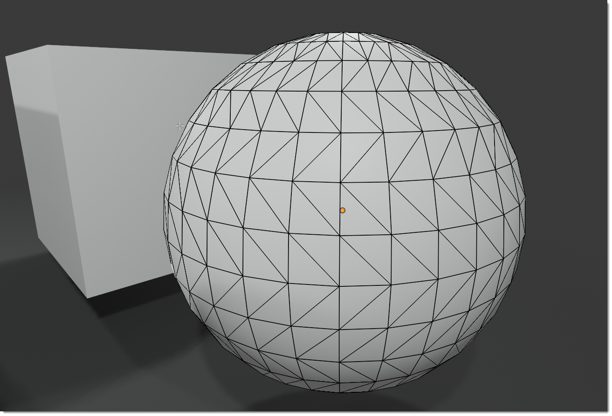

-------------------------------------------------------------------------------------------

Tris to Quads
****************

The tris to quad mode is a mode that allows you to convert the triangles into quads, this is an example of the Tris Mode Mesh:

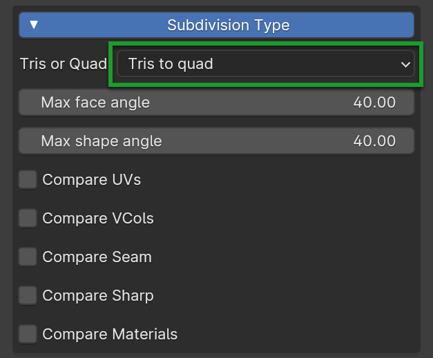

|

Max Face Angle
^^^^^^^^^^^^^^^^^^^^^

This parameter, ranging from 0 to 180, determines the threshold for the functionality of this tool on neighboring triangles.
When set to 0.0, it will exclusively connect adjacent triangles that create a precise rectangle
(such as right-angled triangles sharing their hypotenuses). Increasing values become necessary for triangles featuring
a shared edge that is diminutive compared to the other edges of the triangles.

Max Shape Angle
^^^^^^^^^^^^^^^^^^^^^

This parameter is similar to Max Face Angle, but instead of considering the angle between the planes of the faces, it considers
the angle between the planes of the faces and the planes of the adjacent faces.

Compare UVs
^^^^^^^^^^^^^^^^^^^^^

When activated, this feature inhibits the merging of triangles unless they are also adjacent in the active UV map.

Compare VCols
^^^^^^^^^^^^^^^^^^^^^

Enabling this option prevents the merging of triangles lacking a corresponding Color Attribute color.

Compare Seam
^^^^^^^^^^^^^^^^^^^^^

Once activated, this function hinders the union of triangles sharing an edge marked as a seam.

Compare Sharp
^^^^^^^^^^^^^^^^^^^^^

When turned on, this function obstructs the merging of triangles sharing an edge labeled as sharp.

Compare Materials
^^^^^^^^^^^^^^^^^^^^^
Enabling this feature restricts the merging of triangles that don't share the same assigned material.

|

Triangulate Mode
-------------------

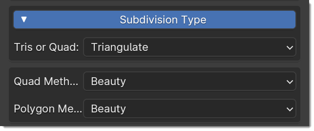

